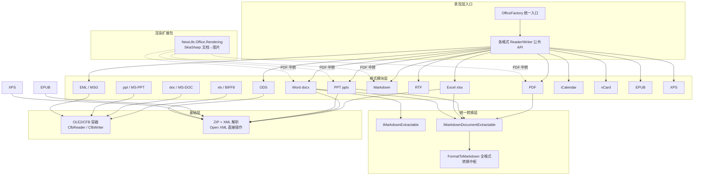
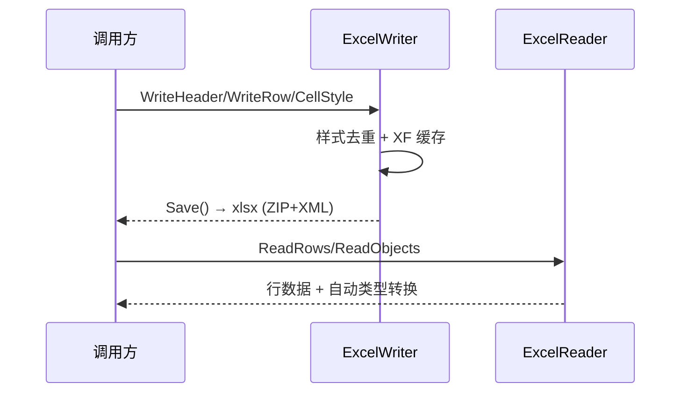
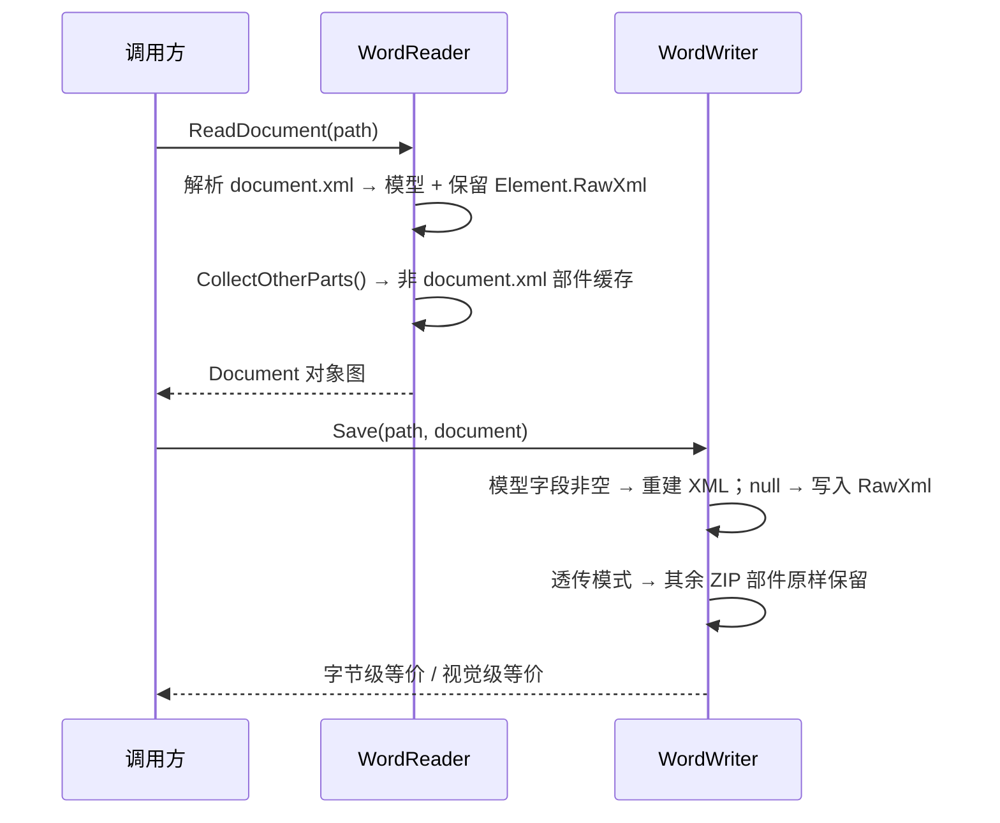
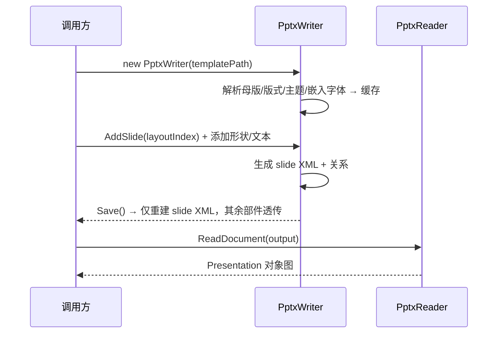
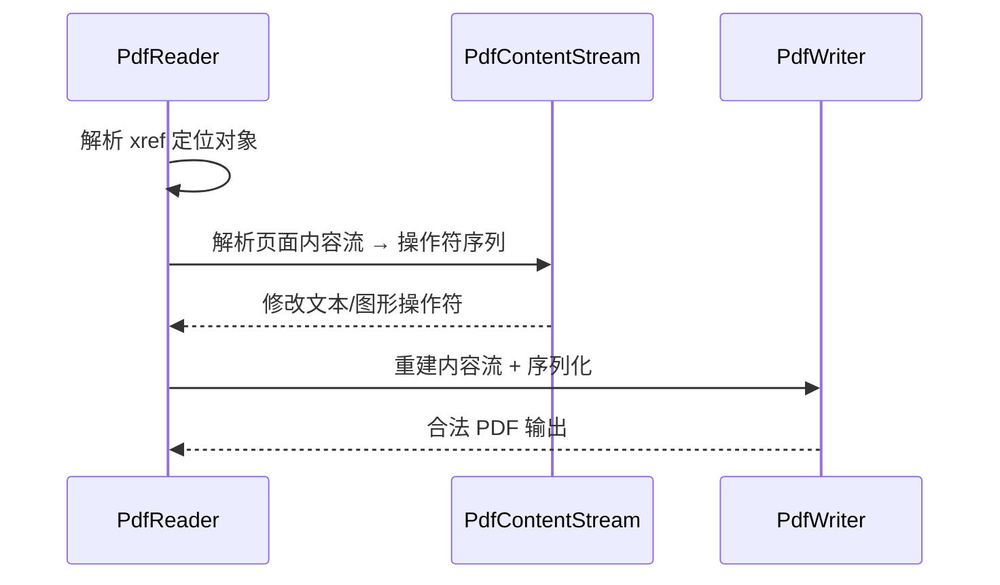
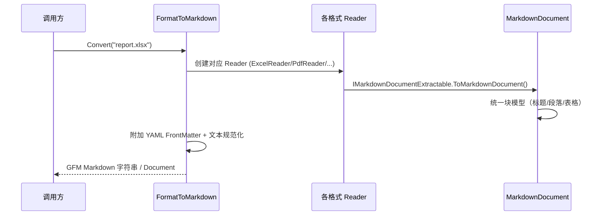

# NewLife.Office 架构设计

> 版本：v1.1 | 日期：2026-08-06
> 需求对应：[需求文档](需求文档.md) | 功能清单：[功能清单](功能清单.md)

## 1. 整体架构

NewLife.Office 采用**分层 + 模块化**架构，按文件格式组织为独立模块，共用 OLE2/CFB 二进制基础层，并通过统一转换层与渲染扩展包提供跨格式能力。

### 1.1 分层职责

| 层 | 职责 | 说明 |
|----|------|------|
| **格式模块层** | 各格式读写/模板/转换 | 每个格式独立目录，Reader/Writer/Model 三件套 |
| **OLE2/CFB 基础层** | 老式二进制容器 | xls/doc/ppt/msg 共用，避免重复解析 |
| **统一转换层** | 文档 → Markdown | `IMarkdownDocumentExtractable` 统一 AST，单一序列化器 |
| **渲染扩展包** | 文档 → 图片 | 独立 NuGet（依赖 SkiaSharp），与主库零依赖定位隔离 |
| **统一入口** | 便捷 API | `OfficeFactory.ReadText/ReadMarkdown/CreateReader` |

### 1.2 核心设计原则

1. **零外部依赖**：主库仅依赖 `NewLife.Core`，直接操作 ZIP + XML / PDF / OLE2 底层结构，避免中间层开销
2. **保真架构**：按格式复杂度采用 L2/L3 级保真（见 §3），确保读→改→写往返不丢内容
3. **统一模型**：每个格式有完整对象模型（Models/），Reader 填充模型、Writer 从模型重建
4. **模型 + RawXml 透传兜底**：模型覆盖常用属性，未建模属性通过原始 XML 透传保留
5. **跨格式转换**：Markdown 为统一 AST 中枢，各格式实现转换接口即可输出 GFM Markdown

---

## 2. 各模块架构

### 2.1 M — Excel（xlsx/xls）

#### 职责

| 职责 | 说明 |
|------|------|
| xlsx 读写 | 直接操作 ZIP + sheet/worksheet + sharedStrings + styles |
| xls 读写 | 基于 OLE2/CFB 层的 BIFF8 记录流解析/生成 |
| 模板填充 | 占位符替换 + 列表区域扩展 |
| 对象映射 | `IEnumerable<T>` ↔ 表格，支持 `[DisplayName]`/`[Description]` |

#### 核心组件

| 组件 | 所在工程 | 说明 |
|------|----------|------|
| `ExcelWriter` | NewLife.Office | xlsx 写入器（partial：主文件/Internal/Save），样式管理 + XF 缓存 |
| `ExcelReader` | NewLife.Office | xlsx 读取器，自动类型转换，`ReadObjects<T>` |
| `ExcelTemplate` | NewLife.Office | xlsx 模板填充 |
| `BiffReader`/`BiffWriter` | NewLife.Office | xls BIFF8 读写（复用 OLE2/CFB 层） |
| `CellStyle`/`Models/*` | NewLife.Office | 样式模型（CellFormat/ConditionalFormatting/DataValidation 等 18 模型） |
| `PivotBuilder` | NewLife.Office | 数据透视表构建 |

#### 关键流程：xlsx 读写往返

#### 设计要点
- **样式管理器**：内部组件去重 + XF 缓存，避免 styles.xml 膨胀
- **长数字保护**：Int64 使用整数样式，避免科学计数法；身份证号/前导零文本化
- **BIFF8**：SST 共享字符串 + XF/FONT/FORMAT 样式记录 + MERGEDCELLS/HYPERLINK 等扩展记录

---

### 2.2 W — Word（docx/doc）

#### 职责

| 职责 | 说明 |
|------|------|
| docx 高保真读写 | L3 级：模型 + RawXml 透传 + ZIP 部件透传 |
| 模板填充 | 占位符/表格区域/图片/对象属性映射/XML 拆分合并 |
| 格式转换 | docx → HTML/PDF/Markdown |
| 日常编辑 | 查找替换（跨 Run 保留格式）、表格行列操作、多节读写 |
| doc 读取 | OLE2 + MS-DOC 纯文本提取 + CHPX/PAPX 段落格式提取 |

#### 核心组件

| 组件 | 所在工程 | 说明 |
|------|----------|------|
| `WordReader` | NewLife.Office | `ReadDocument()` 完整对象图，`CollectOtherParts()` 部件收集 |
| `WordWriter` | NewLife.Office | 模型 + RawXml 重建 docx，透传模式仅重建 document.xml |
| `WordTemplate` | NewLife.Office | 模板填充 + MailMerge 引擎 |
| `Models/*` | NewLife.Office | Document/Paragraph/Run/Table/Comment/Header/Footer 等 27 模型 |
| `WordEncryptor` | NewLife.Office | AES-128 加密（ECMA-376 Agile Encryption） |
| `WordHtmlConverter`/`WordPdfConverter` | NewLife.Office | docx → HTML/PDF 转换 |
| `DocReader` | NewLife.Office | doc 读取（OLE2 + MS-DOC） |

#### 关键流程：L3 保真往返

#### 设计要点
- **RawXml 兜底**：每个 `Element` 保留 `<w:p>`/`<w:tbl>` OuterXml，未建模属性不丢失
- **部件透传**：styles/numbering/settings/header/footer/footnotes/theme/fonts 原样保留
- **加密链**：Agile Encryption 采用 OLE2 CFB 容器承载加密数据（复用 OLE 层）

---

### 2.3 S — PPT（pptx/ppt）

#### 职责

| 职责 | 说明 |
|------|------|
| pptx 高保真读写 | L2 级：完整对象模型 + 媒体/母版部件透传；形状/图表/组内元素双向保真 |
| 模板填充 | 占位符/表格行/图片/对象映射 |
| 跨文件合并 | 媒体冲突处理 + 关系 ID 重建（含图表/批注/备注/嵌入部件跨文件复制） |
| ppt 读写 | OLE2 + MS-PPT 文本提取（读取）；文本幻灯片写入（PptWriter） |

#### 核心组件

| 组件 | 所在工程 | 说明 |
|------|----------|------|
| `PptxWriter` | NewLife.Office | pptx 写入器（partial：主文件/Xml），`LoadMaster`/`Merge`/`CopySlideFrom` |
| `PptxReader` | NewLife.Office | `ReadDocument()` 完整对象图，`ReadSlide()` 逐页解析 |
| `PptxTemplate` | NewLife.Office | 模板填充 |
| `Models/*` | NewLife.Office | Slide/Shape/TextBox/Table/Chart/GroupShape/Animation 等 27 模型 |
| `PptxPdfConverter` | NewLife.Office | pptx → PDF（文本映射型） |
| `LayoutEngine` | NewLife.Office | 自动排版（title_content/two_column 等） |
| `PptReader` | NewLife.Office | ppt 读取（OLE2 + MS-PPT） |
| `PptWriter` | NewLife.Office | ppt 写入（OLE2：PowerPoint Document + Current User 流，文本幻灯片，续记录拆分） |

#### 关键流程：模板加载 + 写回

#### 设计要点
- **媒体透传**：图片/视频/字体嵌入文件保持字节一致
- **跨文件复制**：媒体文件名冲突自动重命名 + 关系 ID 重建
- **Run 级文本**：四类字体（Latin/EastAsian/ComplexScript/Symbol）独立控制

---

### 2.4 P — PDF

#### 职责

| 职责 | 说明 |
|------|------|
| PDF 创建 | 文本/表格/图片/页眉页脚 + Fluent API |
| PDF 读取 | 文本/元数据/书签/图片提取 + xref 级对象解析 |
| PDF 编辑 | 合并/拆分/旋转/水印/内容流重建 |
| 高级能力 | 加密/签名/表单/注释/PDF-A |

#### 核心组件

| 组件 | 所在工程 | 说明 |
|------|----------|------|
| `PdfWriter` | NewLife.Office | PDF 写入器，字体嵌入（CIDFontType2 + ToUnicode） |
| `PdfReader` | NewLife.Office | PDF 读取器，xref + FlateDecode + 对象解析 |
| `PdfDocument` | NewLife.Office | 对象级文档模型 |
| `PdfFluentDocument` | NewLife.Office | 声明式 Fluent 布局 + 自动分页 |
| `PdfXRefTable`/`PdfObjectParser`/`PdfContentStream` | NewLife.Office | xref 解析/对象解析/内容流重建（L3 基础） |
| `PdfEncryptor` | NewLife.Office | RC4/AES-128/256 加密策略模式 |
| `PdfSigner` | NewLife.Office | PKCS#7 数字签名（手动 ASN.1 DER） |
| `PdfForm`/`PdfA` | NewLife.Office | AcroForm 表单 / PDF-A 合规 |

#### 关键流程：读取 → 修改 → 写回

#### 设计要点
- **中文支持**：系统 TrueType 嵌入，Type0 + Identity-H + CIDToGIDMap + ToUnicode 完整映射链
- **JPEG 直通**：DCTDecode 流不解码直接嵌入，保持原始品质
- **对象级编辑**：内容流解析为操作符序列，修改后重新序列化（区别于字节级复制）

---

### 2.5 MD — Markdown（全格式转换中枢）

#### 职责

| 职责 | 说明 |
|------|------|
| Markdown 解析/写入 | CommonMark + GFM，12 种强类型 AST |
| 正向转换 | MD → HTML/Word/PDF |
| 反向转换 | HTML → MD、Word → MD |
| 全格式中枢 | 各格式 Reader → 统一 AST → GFM Markdown |

#### 核心组件

| 组件 | 所在工程 | 说明 |
|------|----------|------|
| `MarkdownParser` | NewLife.Office | 解析器（含扩展：AutoLinks/YAML/脚注/公式/Emoji 等） |
| `MarkdownWriter` | NewLife.Office | AST → Markdown 文本序列化 |
| `MarkdownDocument`/`Models/*` | NewLife.Office | 强类型块模型（12 种 Block + Inline） |
| `MarkdownPipeline` | NewLife.Office | 可配置管线 + `IMarkdownExtension` 扩展注册 |
| `MarkdownHtmlConverter`/`MarkdownWordConverter`/`MarkdownPdfConverter` | NewLife.Office | MD → HTML/Word/PDF |
| `HtmlToMarkdownConverter` | NewLife.Office | HTML → MD |
| `FormatToMarkdown` | NewLife.Office | 全格式转换中枢入口（Convert/ToDocument） |
| `MarkdownTextCleaner` | NewLife.Office | 文本规范化（控制字符/NBSP/软连字符） |

#### 关键流程：全格式 → Markdown

#### 设计要点
- **统一 AST**：各 Reader 实现 `IMarkdownDocumentExtractable` 直接产出块模型，输出一致性由单一序列化器保证
- **AI 友好**：自动 YAML FrontMatter（标题/源文件/格式）、图片默认跳过、文本规范化
- **类型化错误**：`ConvertErrorException`（Unsupported/Malformed/Encrypted/ResourceLimit）

---

### 2.6 OLE — OLE2/CFB 基础层

#### 职责

| 职责 | 说明 |
|------|------|
| CFB 容器解析 | FAT/miniFAT/目录树/多版本 |
| CFB 容器写入 | 最小合法 CFB + 多流 |
| 提供底层流 | 供 xls/doc/ppt/msg 按名称读取流 |

#### 核心组件

| 组件 | 所在工程 | 说明 |
|------|----------|------|
| `CfbReader` | NewLife.Office | CFB 解析（v3/v4 兼容） |
| `CfbWriter` | NewLife.Office | CFB 写入 |
| `CfbDocument`/`CfbStorage`/`CfbStream` | NewLife.Office | 容器对象模型 |
| `CfbHeader`/`CfbDirectoryEntry` | NewLife.Office | 头部/目录项结构 |

#### 设计要点
- **共用基础层**：xls（Workbook 流）、doc（WordDocument 流）、ppt（PowerPoint Document 流）、msg（MAPI 存储）均通过 OLE 层按名称访问流
- **小流优化**：< 4096 字节流使用 mini-Stream + mini-FAT

---

### 2.7 REN — Rendering 渲染扩展包

#### 职责

| 职责 | 说明 |
|------|------|
| 文档 → 图片 | PDF 直接渲染；Word/PPT/MD 经 PDF 中转 |
| 图片处理 | 缩放/裁剪/旋转/水印/叠加/格式转换 |
| 文字/二维码 | 文字 → 图片、二维码 → 图片 |

#### 核心组件

| 组件 | 所在工程 | 说明 |
|------|----------|------|
| `PdfRenderer`/`PdfPageRenderer` | NewLife.Office.Rendering | PDF 内容流 → SkiaSharp Canvas 渲染管线 |
| `PdfGraphicsState`/`PdfFontMapper` | NewLife.Office.Rendering | PDF 图形状态机 / 字体映射 |
| `WordRenderer`/`PptRenderer`/`MdRenderer` | NewLife.Office.Rendering | DOCX/PPTX/MD → PDF → Image 中转 |
| `ImageHelper`/`TextRenderer`/`QrCodeRenderer` | NewLife.Office.Rendering | 图片处理/文字/二维码 |
| `DocumentPreview` | NewLife.Office.Rendering | 按扩展名自动路由的综合预览 |

#### 设计要点
- **独立包隔离**：依赖 SkiaSharp，与主库零依赖定位冲突隔离；主库对应功能保持 NotSupportedException 占位
- **PDF 中转**：Word/PPT/Markdown 先转 PDF，再复用 PDF 渲染管线（一处渲染逻辑，多处复用）

---

## 3. 保真架构（L2/L3 级）

NewLife.Office 按格式复杂度采用不同保真等级，核心目标是**读→改→写往返不丢内容**。

| 等级 | 格式 | 策略 | 往返保证 |
|------|------|------|---------|
| **L3** | Word docx、PDF | 完整对象模型 + RawXml 透传兜底 + ZIP 部件完整透传（docx）/ 对象级解析 + 内容流重建（PDF） | 不改动 = 字节级等价；改动 = 视觉级等价 |
| **L2** | PPT pptx | 完整对象模型 + 媒体/母版 ZIP 部件透传 | 媒体字节一致 + 视觉等价 |
| **L1** | 轻量格式（RTF/ODS/EML/ICS/VCF/EPUB/XPS） | 完整对象模型 | 结构级等价 |
| **L0** | 二进制只读（doc/ppt/xls） | 解析提取；ppt 已补最小写入（PptWriter 文本幻灯片） | 只读为主，ppt 基础写入 |

### 3.1 L3 关键决策（Word）

- **Element.RawXml 保留**：每个元素保存原始 OuterXml，Writer 在模型字段为 null 时回退写 RawXml → 未建模属性（删除线/高亮/字符间距/段落边框）不丢失
- **ZIP 部件透传**：`CollectOtherParts()` 收集非 document.xml 部件，透传模式仅重建 document.xml
- **权衡**：模型体积大 vs 保真度高——选择保真（对比：纯模型方案丢失格式，纯 XML 方案丢失可编程性）

### 3.2 L3 关键决策（PDF）

- **对象级解析**：xref → 对象解析器 → 内容流操作符序列，支持修改后重建
- **权衡**：重建复杂度高 vs 字节级复制无法修改——选择对象级（满足水印/覆盖/表单填充等编辑需求）

---

## 4. 设计决策

| 决策 | 选项 | 选择 | 理由 |
|------|------|------|------|
| 底层实现 | Open XML SDK / 直接操作 ZIP+XML | 直接操作 | 零外部依赖、避免中间层开销、性能优先 |
| 依赖策略 | 依赖第三方库 / 仅 NewLife.Core | 仅 NewLife.Core | 与 NewLife 生态一致，包体积 <500KB |
| Markdown 定位 | 孤立解析器 / 全格式转换中枢 | 全格式中枢 | 全格式双向转换差异化，喂 AI 知识库 |
| 渲染能力 | 内置主库 / 独立扩展包 | 独立包（Rendering） | 零依赖定位与 SkiaSharp 冲突，拆包隔离 |
| 保真等级 | 纯模型 / 模型+RawXml / 纯 XML | 模型+RawXml（L3） | 可编程性 + 保真度兼得 |
| 老格式支持 | 不支持 / 只读 / 读写 | 只读（doc），xls 读写，ppt 读写（文本级） | 需求聚焦迁移场景；ppt 写入仅文本幻灯片最小可用 |
| xls 写入 | 重写全部 BIFF8 / 基于 CFB 层 | 基于 CFB 层 | OLE2/CFB 为 xls/doc/ppt/msg 共用基础 |
| 图片渲染路由 | 各格式独立渲染 / PDF 中转 | PDF 中转 | 一处 PDF 渲染管线，Word/PPT/MD 复用 |
| API 风格 | 各格式独立 API / 统一入口 | 独立 API + OfficeFactory | 格式差异大，独立 API 更清晰；统一入口提供便捷 |
| 内容识别 | 扩展名判断 / magic bytes | 扩展名判断（规划 magic） | 当前以扩展名为准，内容识别（magic bytes）为远期演进方向 |

---

## 5. 关键设计决策（被否决的替代方案）

| 决策 | 被否决方案 | 否决理由 |
|------|-----------|---------|
| 底层实现 | 基于 Open XML SDK | 引入外部依赖，与零依赖定位冲突；间接层影响性能 |
| 渲染能力 | 内置主库 | 破坏主库零依赖承诺，包体积激增；拆分后主库/Rendering 各取所需 |
| PDF 编辑 | 字节级复制（合并/拆分仅重排对象） | 无法满足内容流级修改（水印/覆盖/表单填充）；对象级重建成本可控 |
| Word 保真 | 纯对象模型 | 未建模属性（高亮/边框/域代码等）丢失；RawXml 兜底成本低收益高 |
| Markdown 输出 | 各格式各自拼字符串 | 格式不一致、难维护；统一 AST + 单一序列化器保证一致性 |

---

（完）
